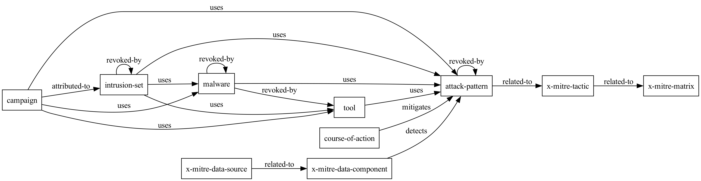
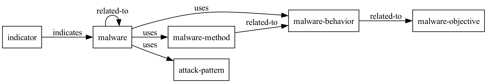

<!-- omit in toc -->
# stix2-explorer

A Python library for exploring STIX 2 content as [directed acyclic graphs (DAGs)](https://en.wikipedia.org/wiki/Directed_acyclic_graph) using [networkx](https://github.com/networkx/networkx) and [GraphViz](https://graphviz.org/).






## Features

- Easily read STIX 2 content from a variety of sources (i.e. from local files or remote files)
- Explore relationships between STIX 2 objects as both directed and undirected graphs
- Reduce NetworkX digraphs to sequences of doubles or triples (i.e. SO or SPO - e.g., `malware` -> `attack-pattern` or `malware` -> `uses` -> `attack-pattern`)
- Render STIX 2 content as DAGs using GraphViz DOT markup

## Design notes

- The library is designed to be modular and extensible - different producers of STIX 2 content have different ways of representing relationships between objects, and the library is designed to be able to handle these differences

## Usage

### Python

To create a directed graph which represents the relationships that exist between sets of STIX 2 objects:

```python
import stix2_explorer.util as util

ENTERPRISE_ATTACK_URL = 'https://raw.githubusercontent.com/mitre-attack/attack-stix-data/master/enterprise-attack/enterprise-attack.json'

src = util.get_data_source(ENTERPRISE_ATTACK_URL)
g = util.stix2_objects_to_nx_digraph(src.query())
```

To translate the directed graph into an undirected graph:

```python
g = g.to_undirected()
```
